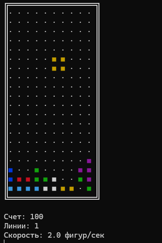

# Python Tetris Game

[](https://www.python.org/downloads/)
[](https://opensource.org/licenses/MIT)

Классическая игра Tetris, реализованная на ЧИСТОМ Python с применением принципов SOLID и чистой архитектуры.



## Особенности

- 🧩 Реализация всех стандартных фигур тетрамино
- 🎮 Поддержка управления как в Windows, так и в Linux/Mac
- ⚙️ Гибкая система конфигурации
- 📊 Подсчет очков по классическим правилам Tetris
- 🚀 Постепенное увеличение скорости игры

## Управление

← → - движение влево/вправо

↑ - поворот фигуры

↓ - ускоренное падение

Пробел - мгновенное падение

Q - выход из игры

## Установка

1. Клонируйте репозиторий:
```bash
git clone https://github.com/seniorpython826/Tetris.git
cd Tetris
```

2. Запуск игры через (CMD):

```
python main.py
```


## Возможные проблемы

1. Если игра не реагирует на клавиши в Linux

```
# Установите поддержку терминала
sudo apt-get install python3-tk
```

2. Если не отображаются цвета:
- Убедитесь, что используете терминал с поддержкой ANSI-цветов
- Попробуйте запустить через ```python -m main``` вместо ``` python main.py ```
